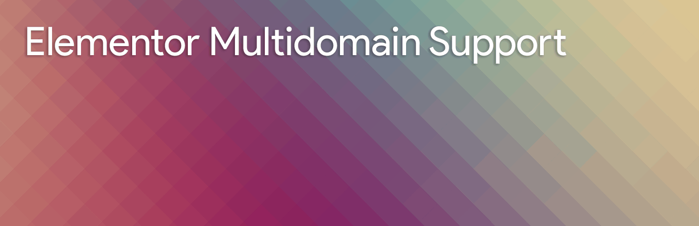

# WordPress - Elementor Multidomain Support

This plugin will help those who have a Multilanguage website with a multi-domain structure,
the plugin will add to Elementator Page Builder the support for multi-domains structure.

## Installation

1. Upload `elementor-multidomain-support` folder to the `/wp-content/plugins/` directory
2. Activate the plugin through the 'Plugins' menu in WordPress
3. Check settings and setup server side solution

## Helpful information
[Plugin Handbook](https://developer.wordpress.org/plugins/wordpress-org/how-to-use-subversion/)

# LICENSE

